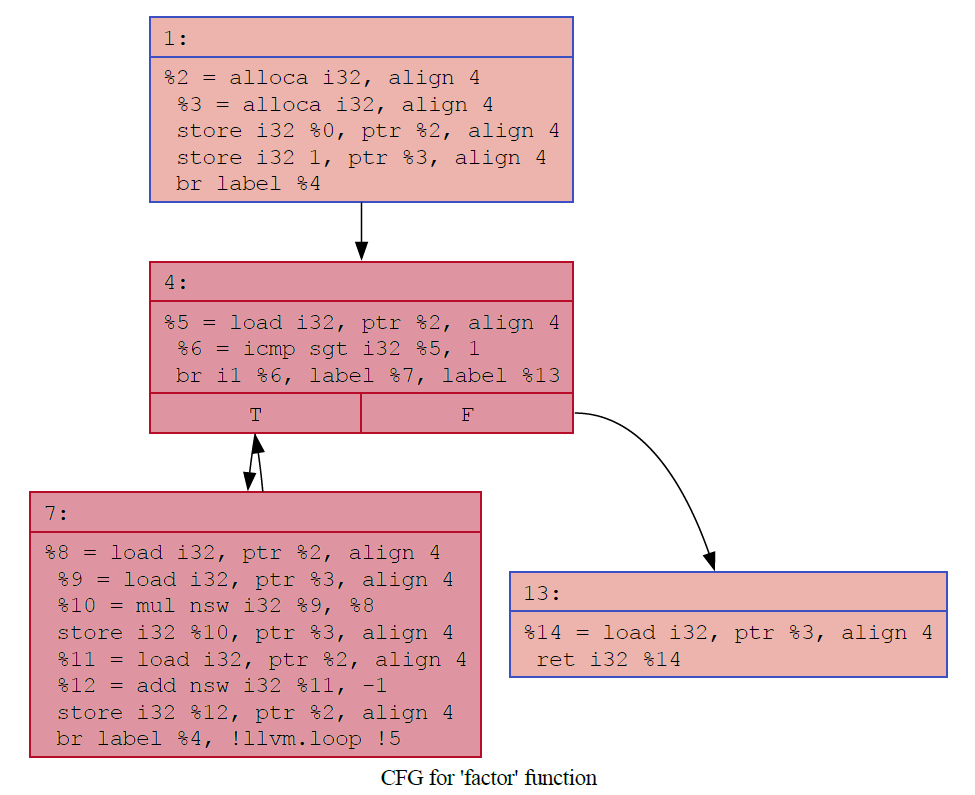

# 基本块和控制流图

## 控制流图(Control Flow Graph, CFG)

控制流图是编译器分析中用于表示程序中所有可能的执行路径的一种图结构。逻辑上每个算子或者指令都有输入/输出，各输入输出互相衔接，构成图(Graph)，但为了着重强调控制流的影响，并简化图的结构，CFG首先把代码划分成基本块(Basic Block, BB)，即一段没有跳转或分支的顺序执行指令，并将基本块作为CFG的节点，而边则描述了基本块之间的执行顺序（包括跳转关系）。 例如下面的CFG中，每个代码块就是一个基本块。CFG描述了基本块之间的跳转关系，是优化、分析、代码生成等阶段的核心数据结构之一。

{: width="50%"}

## 基本块(Basic Block, BB)

基本块指一段尽可能长的连续执行的指令序列，s.t.这段指令序列只能从第一行指令开始执行且除最后一条指令外，指令序列中不包含分支、跳转、终止指令。

更具体地，当遇到以下指令时会产生一个新的基本块:

- 过程和函数（区别在于无和有返回值）入口点
- 跳转或分支的目标指令
- 条件分支之后的直通(fallthrough)指令（可以理解为例如A; if(...){B}; C中，如果if不执行，则A会直通到C，C也会成为新的基本块的开始）
- 引发异常的指令之后的指令（即一段指令序列中可能抛出异常的位置。虽然高级语言中try{...}catch{...}等用法看起来try中处处都可能抛出异常，但在编译器中真正可能抛出异常的原子指令只有a.显示的RAISE/throw，和b.用户函数调用。其他算数、内存访问要么在前端被检测和拆分，例如a/b可以拆分成除法+异常检查，要么就不拆分基本块，例如C/C++中有符号整数溢出、除0、非法移位、数组越界访问、空指针解引用、使用未初始化的值、访问已销毁的变量、重复释放同一内存等未定义行为(Undefined Behavior, UB)就不会成为基本块的边界）
- 异常处理程序的起始指令

而一个基本块的结束指令可能是：

- 直接和间接的无条件和条件分支指令
- 可能引发异常的指令
- return指令（过程虽然没有返回值但也有ret)
- 如果函数调用不能返回，用于抛出异常的函数或特殊调用指令，如C中的longjmp和exit

值得注意的是，基本块都是在过程和函数内部划分的，因此其内的第一条/最后一条指令必定是某基本块的边界指令。但调用函数的位置不一定会是边界指令，调用指令只是一条普通指令，算完后会接着执行下一条，和其他普通指令没什么区别。

通常编译器会先将高级语言转化为IR后再划分基本块，主要原因是高级语言中一行代码包含的信息比较多，需要先做拆分。

## CFG的构建

CFG是一个有向图。它以基本块作为节点，如果一个基本块A执行完之后，可以跳转到另一个基本块B，则图中包含从A节点到B节点的有向边。具体地：

- 如果当前基本块以分支指令结尾，则在当前基本块与所跳转到的目标基本块之间加入一条有向边
- 如果当前基本块以条件分支指令结尾，则在当前基本块以及跳转条件成立、不成立的目标基本块之间分别加入一条有向边（共两条边）
- 如果当前基本块以返回指令结尾，则不需要加入新的边
- 如果当前基本块不是以跳转指令结束，则在当前基本块和相邻的后继基本块之间加入一条有向边

## LLVM IR中的基本块

```C
// 6.c
int func(int a, int b) {
    int sum = 0;
    for (int i = 1; i <= 10; i++) {
        if (i % 2 == 0) {
            sum += a;
        }
        else {
            sum += b;
        }
    }
    return sum;
}
int main() {
    func(1, 2);
}
```

在LLVM IR中，每个BB都可以有一个label，例如下面的`7`。标签指示了LLVM IR中新的基本块的开始，也让后续的br、switch等跳转指令能引用到正确的BB。Entry块（函数的第一个块）打印时一般会被省略标签，因为没有任何指令需要跳回它。但它实际上还是有标签的（下例中为`2`）。

```text
// clang -S -emit-llvm 6.c -o 6.ll
; Function Attrs: noinline nounwind optnone uwtable
define dso_local i32 @func(i32 noundef %0, i32 noundef %1) #0 {
  %3 = alloca i32, align 4
  %4 = alloca i32, align 4
  %5 = alloca i32, align 4
  %6 = alloca i32, align 4
  store i32 %1, ptr %3, align 4
  store i32 %0, ptr %4, align 4
  store i32 0, ptr %5, align 4
  store i32 1, ptr %6, align 4
  br label %7

7:                                                ; preds = %23, %2
  %8 = load i32, ptr %6, align 4
  %9 = icmp sle i32 %8, 10
  br i1 %9, label %10, label %26

10:                                               ; preds = %7
  %11 = load i32, ptr %6, align 4
  %12 = srem i32 %11, 2
  %13 = icmp eq i32 %12, 0
  br i1 %13, label %14, label %18

14:                                               ; preds = %10
  %15 = load i32, ptr %4, align 4
  %16 = load i32, ptr %5, align 4
  %17 = add nsw i32 %16, %15
  store i32 %17, ptr %5, align 4
  br label %22

18:                                               ; preds = %10
  %19 = load i32, ptr %3, align 4
  %20 = load i32, ptr %5, align 4
  %21 = add nsw i32 %20, %19
  store i32 %21, ptr %5, align 4
  br label %22

22:                                               ; preds = %18, %14
  br label %23

23:                                               ; preds = %22
  %24 = load i32, ptr %6, align 4
  %25 = add nsw i32 %24, 1
  store i32 %25, ptr %6, align 4
  br label %7, !llvm.loop !5

26:                                               ; preds = %7
  %27 = load i32, ptr %5, align 4
  ret i32 %27
}

; Function Attrs: noinline nounwind optnone uwtable
define dso_local i32 @main() #0 {
  %1 = call i32 @func(i32 noundef 1, i32 noundef 2)
  ret i32 0
}
```
