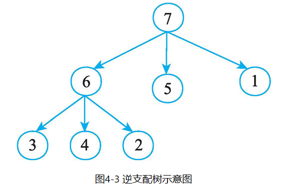

# 支配分析

## 基本概念

**支配(Dominance, Dom)**：当且仅当从入口节点`Entry`到节点`N`的每一条路径都经过节点`D`，则称节点`D`支配节点`N`（`D`可以为`Entry`和`N`）。节点`N`的所有支配节点全集记为`Dom(N)`

**严格支配节点(Strict Dominators, SDom)**：`Dom(N) - N`

**直接支配节点(Immediate Dominator, IDom)**：`N`的所有严格支配节点`SDom(N)`中，同时也被`SDom(N)`中所有节点支配的节点。或者更简洁的说，`N`的所有严格支配节点中离`N`最近的节点

**支配树(Dominator Tree, DT)**：利直接支配节点关系构建的树形结构，其中节点即支配分析中的节点，子节点为父节点直接支配的所有节点

**支配边界(Dominance Frontier, DF)**：`D`的支配边界`DF(D)`指所有满足以下要求的节点`N`的集合：存在`N`的某个前驱节点`P`，使得`D`支配`P`且`D`不严格支配`N`（不严格支配指要么不支配，要么自我支配）

**后支配(Post Dominance, PDom)**：当且仅当从`N`到出口节点`Exit`的每一条路径都经过`P`，则称节点`P`后支配节点`N`

**严格后支配节点(Post Strict Dominators, PSDom)**：`PSDom(N) - N`

**直接后支配节点(Post Immediate Dominator, PIDom)**：`N`的所有严格后支配节点`PSDom(N)`中，同时也被`PSDom(N)`中所有节点后支配的节点。或者更简洁的说，`N`的所有严格后支配节点中离`N`最近的节点

**后支配树(Post Dominator Tree)**：利直接后支配节点关系构建的树形结构，其中节点即支配分析中的节点，子节点为父节点直接后支配的所有节点

{: width="50%"} {: width="25%"}

| 节点 |     其支配节点     |   其严格支配节点   | 其直接支配节点 |   其不严格支配节点    | 其支配边界 |    其后支配节点     |  其严格后支配节点   | 其直接后支配节点 |
|:--:|:-------------:|:-----------:|:-------:|:-------------:|:-----:|:-------------:|:-----------:|:--------:|
| 1  | 1,2,3,4,5,6,7 | 2,3,4,5,6,7 |  2,5,7  |       1       |  NA   |       1       |     NA      |    NA    |
| 2  |    2,3,4,6    |    3,4,6    |  3,4,6  |    1,2,5,7    |   7   |       2       |     NA      |    NA    |
| 3  |       3       |     NA      |   NA    | 1,2,3,4,5,6,7 |   6   |       3       |     NA      |    NA    |
| 4  |       4       |     NA      |   NA    | 1,2,3,4,5,6,7 |   6   |       4       |     NA      |    NA    |
| 5  |       5       |     NA      |   NA    | 1,2,3,4,5,6,7 |   7   |       5       |     NA      |    NA    |
| 6  |       6       |     NA      |   NA    | 1,2,3,4,5,6,7 |   7   |    2,3,4,6    |    2,3,4    |  2,3,4   |
| 7  |       7       |     NA      |   NA    | 1,2,3,4,5,6,7 |  NA   | 1,2,3,4,5,6,7 | 1,2,3,4,5,6 |  1,5,6   |

一般而言，支配分析的对象是CFG，即以函数为边界，以基本块为节点，有唯一一个入口基本块和一个或多个基本块。在LLVM中，支配分析也仅限于单个函数的CFG内进行。如果有更高精度的需求，也可以以指令为节点。当有多个入口或出口时，分析阶段会先在CFG上引入一个虚拟入口/出口节点，并将其连接到所有真实入口/出口上。

## 支配分析有什么用？

## 支配分析算法

