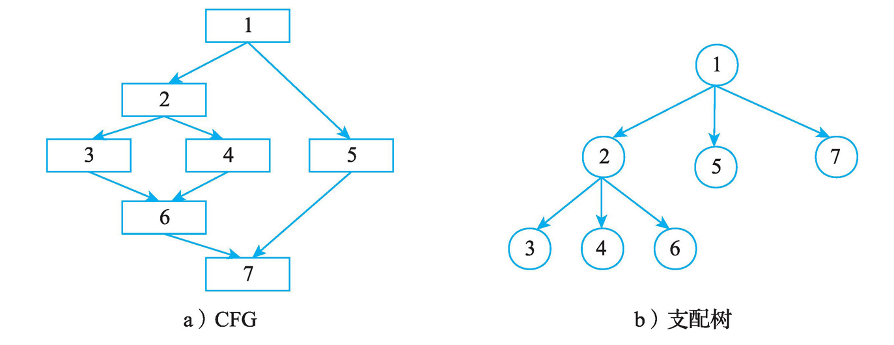
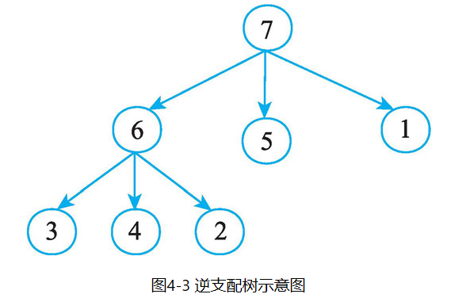
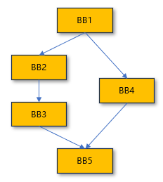
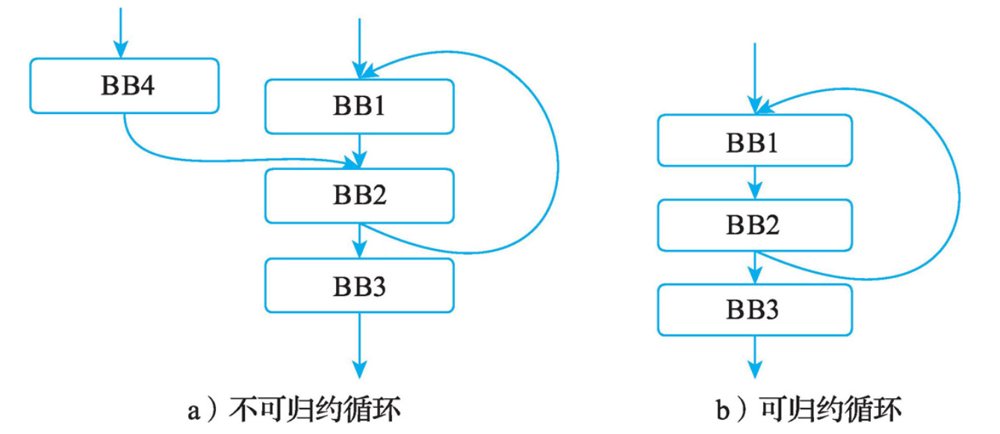
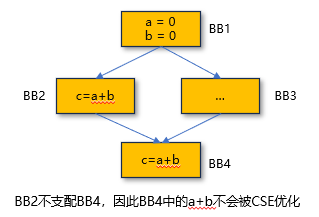
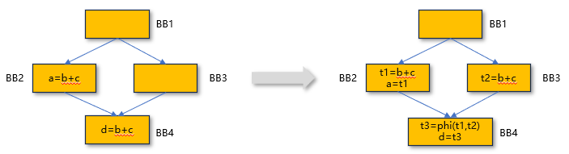

# 支配分析

## 基本概念

**支配(Dominance, Dom)**：当且仅当从入口节点`Entry`到节点`N`的每一条路径都经过节点`D`，则称节点`D`支配节点`N`（`D`可以为`Entry`和`N`）。节点`N`的所有支配节点全集记为`Dom(N)`

**严格支配节点(Strict Dominators, SDom)**：`Dom(N) - N`

**直接支配节点(Immediate Dominator, IDom)**：`N`的所有严格支配节点`SDom(N)`中，同时也被`SDom(N)`中所有节点支配的节点。或者更简洁的说，`N`的所有严格支配节点中离`N`最近的节点

**支配树(Dominator Tree, DT)**：利直接支配节点关系构建的树形结构，其中节点即支配分析中的节点，子节点为父节点直接支配的所有节点

**支配边界(Dominance Frontier, DF)**：`D`的支配边界`DF(D)`指所有满足以下要求的节点`N`的集合：存在`N`的某个前驱节点`P`，使得`D`支配`P`且`D`不严格支配`N`（不严格支配指要么不支配，要么自我支配）

**后支配(Post Dominance, PDom)**：当且仅当从`N`到出口节点`Exit`的每一条路径都经过`P`，则称节点`P`后支配节点`N`

**严格后支配节点(Post Strict Dominators, PSDom)**：`PSDom(N) - N`

**直接后支配节点(Post Immediate Dominator, PIDom)**：`N`的所有严格后支配节点`PSDom(N)`中，同时也被`PSDom(N)`中所有节点后支配的节点。或者更简洁的说，`N`的所有严格后支配节点中离`N`最近的节点

**后支配树(Post Dominator Tree)**：利直接后支配节点关系构建的树形结构，其中节点即支配分析中的节点，子节点为父节点直接后支配的所有节点


{: width="50%"} {: width="25%"}

| 节点 |     其支配节点     |   其严格支配节点   | 其直接支配节点 |   其不严格支配节点    | 其支配边界 |    其后支配节点     |  其严格后支配节点   | 其直接后支配节点 |
|:--:|:-------------:|:-----------:|:-------:|:-------------:|:-----:|:-------------:|:-----------:|:--------:|
| 1  | 1,2,3,4,5,6,7 | 2,3,4,5,6,7 |  2,5,7  |       1       |  NA   |       1       |     NA      |    NA    |
| 2  |    2,3,4,6    |    3,4,6    |  3,4,6  |    1,2,5,7    |   7   |       2       |     NA      |    NA    |
| 3  |       3       |     NA      |   NA    | 1,2,3,4,5,6,7 |   6   |       3       |     NA      |    NA    |
| 4  |       4       |     NA      |   NA    | 1,2,3,4,5,6,7 |   6   |       4       |     NA      |    NA    |
| 5  |       5       |     NA      |   NA    | 1,2,3,4,5,6,7 |   7   |       5       |     NA      |    NA    |
| 6  |       6       |     NA      |   NA    | 1,2,3,4,5,6,7 |   7   |    2,3,4,6    |    2,3,4    |  2,3,4   |
| 7  |       7       |     NA      |   NA    | 1,2,3,4,5,6,7 |  NA   | 1,2,3,4,5,6,7 | 1,2,3,4,5,6 |  1,5,6   |

一般而言，支配分析的对象是CFG，即以函数为边界，以基本块为节点，有唯一一个入口基本块和一个或多个基本块。在LLVM中，支配分析也仅限于单个函数的CFG内进行。如果有更高精度的需求，也可以以指令为节点。当有多个入口或出口时，分析阶段会先在CFG上引入一个虚拟入口/出口节点，并将其连接到所有真实入口/出口上。

## 支配分析的作用

LLVM中支配分析的作用众多，下面举几例说明。

### SSA构造 - 插入φ节点

插入φ节点的本质是在寻找BB的汇合点，使得这个汇合点的前驱路径能带来对于某一变量的不同定值。入度>1的BB未必需要φ节点，不同定值的来源也未必是直接前驱BB。以下图为例：

 - Example1: 如果对var的定值仅发生在BB1中，则BB5无需插入φ
 - Example2: 如果是BB1、BB2存在对var的定值，则BB5需要φ节点

{: width="20%"}

这一需求与支配边界的概念高度契合：支配边界寻找的对象本质上就是这样的汇合点，使得当前BB能不能支配汇合点（Example1），但能支配汇合点的前驱节点（Example2）。利用支配边界放置φ节点的方法、更多关于SSA的解释可参考`静态单赋值和φ`章节。

### 循环优化 - 自然循环识别、循环不变代码移动

**自然循环识别**：自然循环，又称可规约循环(reducible loop)，指只有一个入口的循环。LLVM等大多数编译器都仅识别和优化自然循环，不会将不可规约循环视作循环。自然循环识别的本质就是找打回边(back-edge)，而回边满足：

 - 存在BB2到BB1的跳转关系
 - BB1能严格支配BB2

{: width="50%"}

识别之后，LLVM会围绕循环做一些处理。例如在找到循环头(header，即BB1)后，LoopSimplifyPass会为每个循环头生成唯一的前置块(preheader)，便于后续将循环不变式统一移动到循环外。此时，所有原本流入header的非回边前驱边都会被redirect到preheader，再通过其跳转到header上，即preheader只有一个去header的无条件跳转。如果循环头有且只有一个来自循环外的前驱边，且该前驱边不为关键边(critical edge, 参见章节`静态单赋值和φ`)，则CFG中已有符合条件的preheader，此时就无需新增了。

**循环不变代码移动(Loop Invariant Code Motion, LICM)**：LICM的目标时将循环内每次迭代都产生相同结果、必然执行、且无副作用的指令移动到循环外执行。举例来说，这些指令满足：

 - 原位置再循环内：循环内的所有BB可以通过循环识别拿到循环头尾后，从循环尾开始在CFG上向前回溯，直到循环头为止来拿到
 - 没有控制依赖(control dependence)：即原位置的执行不取决与循环内的其他条件，而是每轮必定执行。这可以通过支配树上查找除循环头外是否还被分支BB严格支配来确定
 - 该指令的所有操作数(operands)是否都在循环外定义，或可被递归地确认为循环不变式

值得额外说明的是，LLVM中并不是符合以上条件就一定会移动到preheader中。这是因为移动是有代价的，例如延长了变量的生命周期。仅当LLVM认为该移动总体上是有盈利时才会执行移动操作。

### 冗余消除 - 公共子表达式消除、部分冗余消除、全局值编号

**公共子表达式消除(Common Subexpression Elimination, CSE)**：CSE目标是优化掉冗余的操作符、操作数（包括操作数的顺序）完全相同的表达式；如果上一次该表达式出现(BB1)到本次出现(BB2)间操作数未被重新定值，且若BB2执行则BB1一定执行，则当前表达式冗余。CSE中支配分析承担了两个目的：

- 提供遍历顺序：遍历BB时需要一个无环的数据结构提供遍历顺序。这个需求和支配树契合，因为支配树包含所有BB且解除了循环
- 确认上一次必定执行：这和支配的概念契合，如果BB1支配BB2，则抵达BB2的所有路径必定经过BB1，即上一次必定执行

{: width="20%"}

**部分冗余消除(Partial Redundancy Elimination， PRE)**：首先解释什么是完全冗余(Full Redundancy)和部分冗余。完全冗余指所有到达该计算的路径，都已经在前面进行过同样的计算，此时删除后者不会改变任何执行结果。部分冗余指只有部分执行路径在到达该计算之前已有相同计算，其余路径没有；此时简单删除会导致无定义使用，必须先补齐未计算的路径才能安全移除。

```text
Entry:
  br i1 %c, label %B, label %C
B:
  %x = a + b
  br label %D
C:
  %y = a + b
  br label %D
D:
  %z = a + b        ; 完全冗余。若%x或%y不存在，则为部分冗余
```

PRE的目标是将沿某些但非全部执行路径重复计算的表达式（即部分冗余），通过代码移动和φ插入，尽可能消除同一路径上的冗余计算，使得任一执行路径上每个表达式最多只执行一次。同时，它也会为后续的全局值编号铺路，使冗余的形式满足完全冗余，使全局值编号能一举全部消除。

{: width="50%"}

上图示例中选择了Latest策略，即在保证消除部分冗余的前提下，把插入点推后到尽可能接近使用点。Earliest则是另一种策略，即找到最靠近入口且满足安全要求的插入点，也就是在B1中插入。Earliest、Latest在不同场景下各有优劣。总之，在PRE中，支配分析承担了两项任务：

- PRE的第一步-φ插入：首先数据流分析会找到所有使得从其开始不论走哪条路径必然有use或def该表达式的所有BB。鬼扯把
- 
- 
- 
- 之后，利用支配边界找到所有汇合点BB，取其交集就是实际需要插入φ节点的位置，因为他们存在前驱提供该表达式，且
- 移动计算时，确认新的计算位置是否支配


**全局值编号(Global Value Numbering, GVN)**：目标是给每个表达式分配一个值号(Value Number)，并在全局范围内复用相同值号的计算，以消除完全冗余。


https://github.com/llvm/llvm-project/blob/694a4887089fb006dc597219485d7354540917c6/llvm/lib/Transforms/Scalar/GVN.cpp#L2886


## LLVM中的支配分析

LLVM中的支配分析的核心产物是支配树。后续所有对严格支配、支配边界等的计算，都是在支配树上产生的。当需要这些“附加信息”时会调用相应算法遍历、查询支配树，而不会在一开始就分析好所有信息。

错的。LLVM有domtree、domfrontier、postdomtree

TODO


```text
PS C:\Users\xjshu\CLionProjects\playground> opt -S --passes=print<domtree> 6.ll -o 6dom.ll
DominatorTree for function: func
=============================--------------------------------
Inorder Dominator Tree: DFSNumbers invalid: 0 slow queries.
  [1] %2 {4294967295,4294967295} [0]
    [2] %7 {4294967295,4294967295} [1]
      [3] %10 {4294967295,4294967295} [2]
        [4] %14 {4294967295,4294967295} [3]
        [4] %22 {4294967295,4294967295} [3]
          [5] %23 {4294967295,4294967295} [4]
        [4] %18 {4294967295,4294967295} [3]
      [3] %26 {4294967295,4294967295} [2]
Roots: %2 
DominatorTree for function: main
=============================--------------------------------
Inorder Dominator Tree: DFSNumbers invalid: 0 slow queries.
```


```text
PS C:\Users\xjshu\CLionProjects\playground> opt -S --passes=print<domfrontier> 6.ll -o 6dom.ll
DominanceFrontier for function: func
  DomFrontier for BB %23 is:     %7
  DomFrontier for BB %2 is:
  DomFrontier for BB %14 is:     %22
  DomFrontier for BB %26 is:
  DomFrontier for BB %22 is:     %7
  DomFrontier for BB %18 is:     %22
  DomFrontier for BB %10 is:     %7
  DomFrontier for BB %7 is:      %7
DominanceFrontier for function: main
  DomFrontier for BB %0 is:
```

逐行解释打印结果
1. 输出头部
DominatorTree for function: func 表示下面一大段内容是对名为 func 的函数执行支配树分析后打印的结果。

=============================-------------------------------- 纯视觉分隔线，用来区分不同函数的输出区块。

2. 中序遍历和编号状态
Inorder Dominator Tree: DFSNumbers invalid: 0 slow queries. “Inorder Dominator Tree” 表示采用中序（inorder）方式遍历并打印树结构 “DFSNumbers invalid” 说明在这次打印中并未计算或启用节点的 DFS 进入/离开编号（它们全为默认值 4294967295，即 -1u） “0 slow queries” 表示在分析过程中没有触发任何需要额外工作（slow queries）的情况。

3. 各节点详细说明
下面的行按树的层级关系缩进，整体格式为：

[节点序号] 节点名称 {DFS-In,DFS-Out} [父节点序号]

[1] %2 {4294967295,4294967295} [0] 节点序号 1，对应名称 %2。 大括号里两项都是 4294967295，表示 DFS 编号未启用。 末尾 [0] 表示它没有父节点（序号 0 表示根）。

[2] %7 {4294967295,4294967295} [1] 序号 2，名称 %7。 它的立即支配者（父节点）是序号 1（即 %2），对应末尾的 [1]。

[3] %10 {4294967295,4294967295} [2] 序号 3，名称 %10。 父节点是序号 2（%7）。

[4] %14 {4294967295,4294967295} [3] 序号 4，名称 %14。 父节点是序号 3（%10）。

[4] %22 {4294967295,4294967295} [3] 同样是序号 4，名称 %22，与 %14 并列于同一深度； 它也由 %10（序号 3）直接支配。

[5] %23 {4294967295,4294967295} [4] 序号 5，名称 %23； 由序号 4 的 %22 直接支配。

[4] %18 {4294967295,4294967295} [3] 序号 4（回到同一深度编号），名称 %18； 由 %10（序号 3）直接支配，与 %14、%22 同级。

[3] %26 {4294967295,4294967295} [2] 序号 3（又回到更浅层级的编号），名称 %26； 它是 %7（序号 2）的另一个子节点。

4. 根节点列表
Roots: %2 列出支配树森林（若存在多个连通分量）中的根节点。这里只有一个根 %2。

5. 下一个函数的支配树概览
DominatorTree for function: main 开始打印 main 函数的结果。

=============================-------------------------------- 分隔线。

Inorder Dominator Tree: DFSNumbers invalid: 0 slow queries. 与前面相同，表示对 main 做了中序遍历打印，但没有展开任何子节点（可能因为 main 内部结构过于简单或不包含对应价值节点）。


Entry 块（函数的第一个块）若未显式命名，会被省略标签，因为没有任何指令需要跳回它。

## 支配分析算法

TODO

