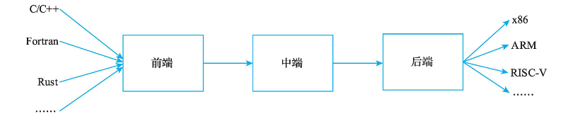

# 概述

## 编译器架构范式

目前流行的编译器通架构为**前端**、**中端**和**后端**组成的**三段式架构**。

**前端**：将输入代码解析成更便于进行编译优化或者目标代码生成的一种IR，并检查输入代码的词法、语法、语义合法。不同输入语言可以转为统一的中间中间表示，以使后续的流程可以语言无关。

**中端**：进行编译优化，提升程序的性能。中端常见的优化有常量传播、死代码消除、循环不变代码外提、循环展开等。通常提到的优化都是语言、架构无关的优化，但现实中也存在语言、架构相关的优化。

**后端**：针对目标硬件硬件，将中端输出的IR翻译成对应的机器码。通常包括指令选择、指令调度、寄存器分配和机器码生成。

