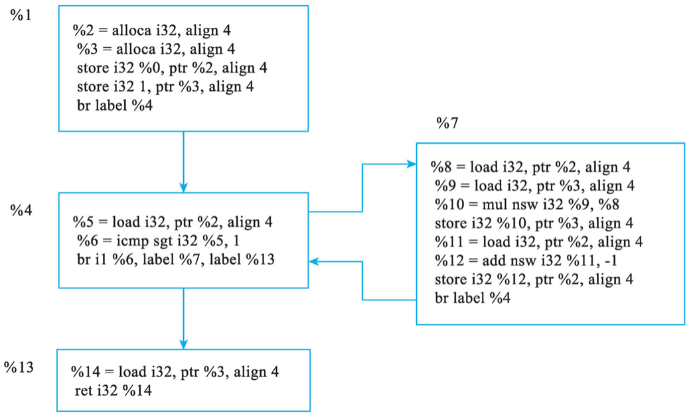

# Pass和中间表示

## Pass和PassManager

### Pass

Pass指的是对编译对象（即中间表示, IR）进行一次扫描并分析或优化。引入Pass概念后，可以将复杂的编译过程分解为多个Pass。例如在LLVM中端优化过程中，所有的优化都是基于LLVM IR，因此可以设计功能独立、实现简单的Pass。根据功能和定位，Pass可分为：

- 分析Pass：只收集信息进行分析，不做任何修改。分析结果供其他Pass使用
- 变换Pass：对IR进行优化变换，一般会使用分析Pass的信息。变换后可能会导致以前的分析Pass的结果失效
- 功能Pass：既分析也不变换，一般用于提供公共功能，例如将IR进行打印

在不同优化等级下，LLVM会调用不同的Passes。有哪些Pass，都是做什么用的可以参考[LLVM Passes](https://llvm.org/docs/Passes.html)。

以LLVM18为例（后续代码示例等都会以LLVM18为基础），希望查看某优化等级下执行的所有Pass可以

```commandline
clang -emit-llvm -c 1.c -o 1.bc
opt -O1 -disable-output -debug-pass-manager=verbose 1.bc   // 以O1为例
```

### PassManager


## IR分类

**中间表示**(Intermediate Representation, **IR**)：是编译器在编译流程中使用的一种程序表示形式。 编译器通常不会直接从源代码生成机器码，而是先将源程序转为一种或多种IR，再在IR上做各种优化，最后再生成目标机器码。这样做的好处包括：

 - 便于将一系列选择、优化等编译要实现的功能拆分成多个子阶段分别实现 (Pass→IR→Pass→IR→...)，提高编译器的可维护性与扩展性
 - 将语言无关的优化与目标无关的优化解耦，支持多种源语言和多种目标硬件架构复用相同中端/后端

编译器的不同阶段会根据不同的目的使用不同形式的IR。他们虽然形式不同，但本质都是同等信息的不同呈现方式。

**树形IR**：指以树状结构表达程序，相比之下侧重语法结构和上下文，一般用于前端。最典型的树IR就是抽象语法树(Abstract Syntax Tree, AST)。树形IR中函数是AST顶层结构中的独立子树，而非被调函数与调用者为父子节点的关系，因为函数定义在语法上是声明单元，而函数调用只是一个指向一个符号引用的表达式节点（例如指向函数），而不是嵌套地包含整个子函数的定义。树形IR的子节点是有序的，不可乱序。树形IR中也没有静态单赋值。

```C
// 1.c
int add(int a, int b);
int main() {
    int res = add(0, 1);
    return 0;
}
int add(int a, int b) {
    int c = a + b;
    c += 1;
    return c;
}
```
```text
// clang -cc1 -ast-dump 1.c  // -cc1表示直接驱动前端，不做链接等步骤
TranslationUnitDecl 0x229f351d9c0 <<invalid sloc>> <invalid sloc>  // TranslationUnitDecl是Clang AST的顶层声明节点，通常对应1个源文件；
    // 0x...是该AST节点再内存中的地址，可以理解成本次编译中该AST的ID；<<...>>表示原始源码起止范围，顶层声明节点不直接对应任何一段真是文本，因此标记为
    // invalid sloc(无效/不存在的源位置)；<...>表示经宏展开或预处理后的位置（若宏展开后才出现问题，定位时有用）
|-TypedefDecl 0x229f351e1f8 <<invalid sloc>> <invalid sloc> implicit __int128_t '__int128'  // TypedefDecl表示一个typedef；
    // implicit表示该节点是编译器自动插入，而非用户在源代码里写的；为__int128定义了别名__int128_t
| `-BuiltinType 0x229f351df90 '__int128' // |-和`-都表示子节点，只是`-表示最后一个子节点
|-TypedefDecl 0x229f351e268 <<invalid sloc>> <invalid sloc> implicit __uint128_t 'unsigned __int128'
| `-BuiltinType 0x229f351dfb0 'unsigned __int128'
|-TypedefDecl 0x229f351e590 <<invalid sloc>> <invalid sloc> implicit __NSConstantString 'struct __NSConstantString_tag'
| `-RecordType 0x229f351e340 'struct __NSConstantString_tag'
|   `-Record 0x229f351e2c0 '__NSConstantString_tag'
|-TypedefDecl 0x229f351e638 <<invalid sloc>> <invalid sloc> implicit __builtin_ms_va_list 'char *'
| `-PointerType 0x229f351e5f0 'char *'
|   `-BuiltinType 0x229f351da70 'char'
|-TypedefDecl 0x229f351e6a8 <<invalid sloc>> <invalid sloc> implicit __builtin_va_list 'char *'
| `-PointerType 0x229f351e5f0 'char *'
|   `-BuiltinType 0x229f351da70 'char'
|-FunctionDecl 0x229f351e888 <1.c:1:1, col:21> col:5 used add 'int (int, int)'  // 若拼写位置和宏展开位置相同，则不写出<<...>>；
    // Clang的位置打印有省略规则，首次打印某一源文件时会完整显示，后续节点若不变则省略文件，若行不变则行也省略；used表示之后会用，告诉CodeGen它应生成代码，
    // 否则可能被是为未用，该丢弃
| |-ParmVarDecl 0x229f351e718 <col:9, col:13> col:13 a 'int'
| `-ParmVarDecl 0x229f351e7a0 <col:16, col:20> col:20 b 'int'
|-FunctionDecl 0x229f3805698 <line:2:1, line:5:1> line:2:5 main 'int ()'
| `-CompoundStmt 0x229f38058f8 <col:12, line:5:1>  // CompoundStmt为复合语句，即{...}中的语句块
|   |-DeclStmt 0x229f38058a8 <line:3:5, col:24>
|   | `-VarDecl 0x229f3805758 <col:5, col:23> col:9 res 'int' cinit
|   |   `-CallExpr 0x229f3805878 <col:15, col:23> 'int'
|   |     |-ImplicitCastExpr 0x229f3805860 <col:15> 'int (*)(int, int)' <FunctionToPointerDecay>
|   |     | `-DeclRefExpr 0x229f38057c0 <col:15> 'int (int, int)' Function 0x229f351e888 'add' 'int (int, int)'
|   |     |-IntegerLiteral 0x229f38057e0 <col:19> 'int' 0
|   |     `-IntegerLiteral 0x229f3805808 <col:22> 'int' 1
|   `-ReturnStmt 0x229f38058e8 <line:4:5, col:12>
|     `-IntegerLiteral 0x229f38058c0 <col:12> 'int' 0
`-FunctionDecl 0x229f3805a60 prev 0x229f351e888 <line:6:1, line:10:1> line:6:5 used add 'int (int, int)'
  |-ParmVarDecl 0x229f3805930 <col:9, col:13> col:13 used a 'int'
  |-ParmVarDecl 0x229f38059b8 <col:16, col:20> col:20 used b 'int'
  `-CompoundStmt 0x229f3805d00 <col:23, line:10:1>  
    |-DeclStmt 0x229f3805c28 <line:7:5, col:18>
    | `-VarDecl 0x229f3805b30 <col:5, col:17> col:9 used c 'int' cinit
    |   `-BinaryOperator 0x229f3805c08 <col:13, col:17> 'int' '+'
    |     |-ImplicitCastExpr 0x229f3805bd8 <col:13> 'int' <LValueToRValue>  // 表达式中的变量是左值（指向内存位置），但加法运算要一个右值
      //（变量存的值本身），编译器在AST里会插入隐式转换，表示“把a/b从内存加载出来，用其值参与计算”
    |     | `-DeclRefExpr 0x229f3805b98 <col:13> 'int' lvalue ParmVar 0x229f3805930 'a' 'int'
    |     `-ImplicitCastExpr 0x229f3805bf0 <col:17> 'int' <LValueToRValue>
    |       `-DeclRefExpr 0x229f3805bb8 <col:17> 'int' lvalue ParmVar 0x229f38059b8 'b' 'int'
    |-CompoundAssignOperator 0x229f3805c88 <line:8:5, col:10> 'int' '+=' ComputeLHSTy='int' ComputeResultTy='int'
    | |-DeclRefExpr 0x229f3805c40 <col:5> 'int' lvalue Var 0x229f3805b30 'c' 'int'
    | `-IntegerLiteral 0x229f3805c60 <col:10> 'int' 1
    `-ReturnStmt 0x229f3805cf0 <line:9:5, col:12>
      `-ImplicitCastExpr 0x229f3805cd8 <col:12> 'int' <LValueToRValue>
        `-DeclRefExpr 0x229f3805cb8 <col:12> 'int' lvalue Var 0x229f3805b30 'c' 'int'  // +=1后的c地址不变，没有SSA
```

**线性IR**：指以有序指令流的形式表达程序，每条指令都是三地址式或近似汇编的简化版本，相比之下侧重以一条条指令展现计算步骤，一般用于中端和后端。

```text
// clang -S -emit-llvm 1.c -o 1.ll  // -S指生成汇编文件，而非编成目标机器码的二进制文件(.o)；-emit-llvm表示输出LLVM IR文本，而非目标架构的汇编(如x86_64指令文本)
; ModuleID = '1.c'  // Module指文件，不是完整程序
source_filename = "1.c"
target datalayout = "e-m:w-p270:32:32-p271:32:32-p272:64:64-i64:64-i128:128-f80:128-n8:16:32:64-S128"  // 描述目标平台的数据布局约定，
  // 包括字节序、指针大小、对齐规则、原生整数宽度、栈对齐等；e指小端存储，m:w指符号名修饰规则为Windows，会影响头文件、库函数选择等；"..."描述了各种数据的对齐规则
target triple = "x86_64-pc-windows-msvc19.42.34436"  // 目标架构x86_64；厂商类型（泛指）pc；操作系统windows；使用的MSVC运行时版本

; Function Attrs: noinline nounwind optnone uwtable  // noinline指禁止编译器自动inline该函数；optnone指关闭所有优化(clang命令默认-O0)；
  // nounwind指编译器认为该函数必定不会抛出异常(一般标准C函数都不会抛出异常，数组越界也是未定义行为UB不算异常)，且不会触发栈展开(stack unwinding)，
  // 栈展开指发生异常后逐层清理函数的调用栈帧中局部对象的析构函数，释放临时资源；uwtable示要为此函数生成完整的unwind表，即使被标记为了nounwind，
  // 必须unwind是Windows/MSVC平台的限制
define dso_local i32 @main() #0 {  // #0标签告诉编译器该怎么处理该函数，#0的描述在IR结尾；dso_local指此符号对当前可执行文件或共享库是本地可见，不需要外部重定位
  %1 = alloca i32, align 4  // alloca指在函数的栈帧上分配一块内存；然后将栈上新分配空间的地址(i32*指针)存入虚拟寄存器%1
  %2 = alloca i32, align 4
  store i32 0, ptr %1, align 4  // O0中给本函数返回值的预留，O2/O3中会删除
  %3 = call i32 @add(i32 noundef 0, i32 noundef 1)  // noundef表示此参数必定已定义，有具体值，有助于更安全的优化
  store i32 %3, ptr %2, align 4
  ret i32 0
}

; Function Attrs: noinline nounwind optnone uwtable
define dso_local i32 @add(i32 noundef %0, i32 noundef %1) #0 {
  %3 = alloca i32, align 4  // 给b在栈上开内存
  %4 = alloca i32, align 4  // 给a在栈上开内存
  %5 = alloca i32, align 4  // 给c在栈上开内存
  store i32 %1, ptr %3, align 4  // 把b存入栈
  store i32 %0, ptr %4, align 4  // 把a存入栈
  %6 = load i32, ptr %4, align 4  
  %7 = load i32, ptr %3, align 4
  %8 = add nsw i32 %6, %7  // nsw指带no‐signed‐wrap检查的加法（即假定有符号加/减/乘法不会发生溢出，若溢出则为未定义行为）
  store i32 %8, ptr %5, align 4  // 把结果放入c栈上的位置
  %9 = load i32, ptr %5, align 4
  %10 = add nsw i32 %9, 1
  store i32 %10, ptr %5, align 4  // 再次把结果放入c栈上的位置
  %11 = load i32, ptr %5, align 4
  ret i32 %11
}

attributes #0 = { noinline nounwind optnone uwtable "min-legal-vector-width"="0" "no-trapping-math"="true" "stack-protector-buffer-size"="8" "target-cpu"="x86-64" "target-features"="+cmov,+cx8,+fxsr,+mmx,+sse,+sse2,+x87" "tune-cpu"="generic" }

!llvm.module.flags = !{!0, !1, !2, !3}  // 本行和后续为各种模块级Meta
!llvm.ident = !{!4}

!0 = !{i32 1, !"wchar_size", i32 2}
!1 = !{i32 8, !"PIC Level", i32 2}
!2 = !{i32 7, !"uwtable", i32 2}
!3 = !{i32 1, !"MaxTLSAlign", i32 65536}
!4 = !{!"clang version 18.1.8"}
```

**图形IR**：指以包含节点和有向边等的图表达程序，相比之下侧重程序的控制流与数据依赖，一般用于中端和后端。常见形式有控制流图(Control Flow Graph, CFG)，其中节点为基本块(Basic Block, BB)，边是可能的执行跳转；和数据流图(Data Flow Graph, DFG)，其中节点是运算或存储操作，边是数据依赖。

```C
int factor(int n) {
    int ret = 1;
    while (n > 1) {
        ret *= n;
        n--;
    }
    return ret;
}
int main() {
    int res = factor(3);
    return 0;
}
```
{: width="50%"}

值得注意的是，和AI编译器不同，LLVM的图IR是有环的。这主要是为了完整支持高层语言的goto跳转，异常处理跳转、递归跳转等特性，即LLVM的目标是准确表达任意高级程序语言的控制流与状态修改，而AI编译器的核心目标侧重于表达数据依赖与数学计算顺序，尽可能消除复杂的控制结构。这就导致AI编译器的计算图一般是无环的，它不支持这些跳转，包括递归。以PyTorch为例：

```python
import torch

@torch.jit.script
def factorial(n: int) -> int:
    if n == 0:
        return 1
    return n * factorial(n - 1)

if __name__ == "__main__":
    print(factorial.graph)
```

```text
RuntimeError: 
 function 'factorial' is called recursively. Recursive calls are not supported:
  File "C:\Users\xjshu\Documents\GitHub\pytorch\main.py", line 8
    if n == 0:
        return 1
    return n * factorial(n - 1)
               ~~~~~~~~~ <--- HERE
```

**为什么树形IR适合前端？**

- 能与编程语言解析过程契合，反应语法嵌套、支持递归，能自然地表达表达式、语句块函数等递归结构，也易于呈现变量的作用域
- 前端不仅要将代码解析成IR，还需要做一系列检查。若发现问题，树形结构只需向上追踪即可轻松获得调用栈并呈现

**线性IR适合什么场景？**

- 线性IR一般会利用“序列”这个核心特性，所有场景都会围绕序列展开
- 例如代码生成：把线性IR直接映射成线性指令序列
- 指令调度：对同一BB内的指令序列调整其顺序，虽然调度算法内部可能会把序列转为依赖DAG来分析，但输入输出都是线性的
- 寄存器分配：图着色或线性扫描算法需要线性序列和线性活跃区间
- BB内重复子表达式消除：扫描每条指令，若遇到相同操作且操作数未被修改，就复用已有结果

**图形IR适合什么场景？**

- 图形IR常用于表达全局依赖、BB间的分析和优化
- 例如SSA构造和化简：分支与合并点易于用图管理
- 常量传播、死代码消除：基于数据流图易于做可达性分析
- 向量化：用图易于找无循环依赖的子图，生成SIMD指令
- 循环变换(Loop Transform)：为改善性能对循环结构做各种等价重写，包括循环展开(Loop Unrolling)把原来迭代n此的循环体复制多份以减少循环分支次数、循环融合(Loop Fusion)把多个具有相同迭代空间的循环合并成一个以减少循环开销并提升数据复用、循环切分(Loop Splitting)把大循环分割成多个小新欢以分别向量化和优化缓存，等
- BB间重复子表达式消除：分析各BB入口处哪些表达式已计算且未被覆盖


