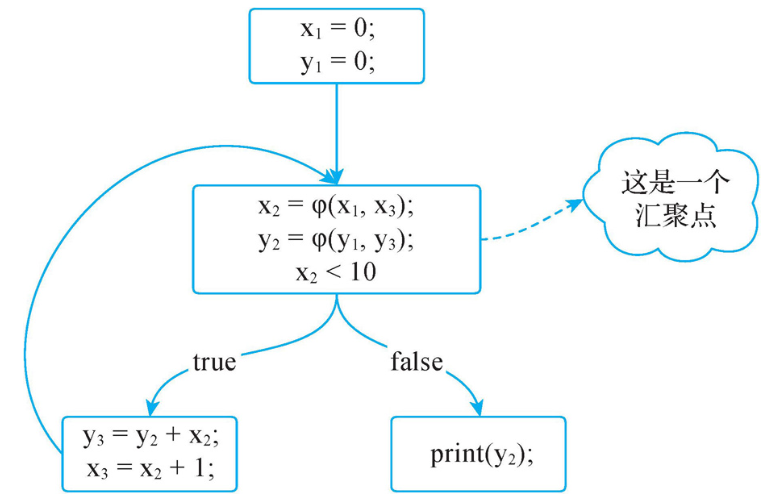
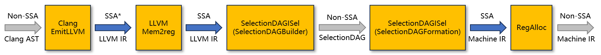
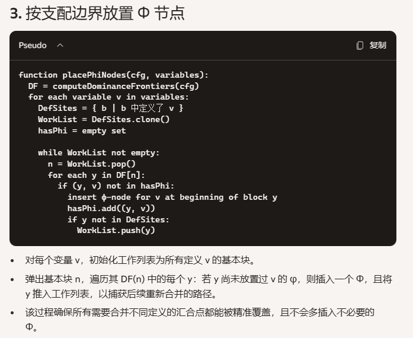
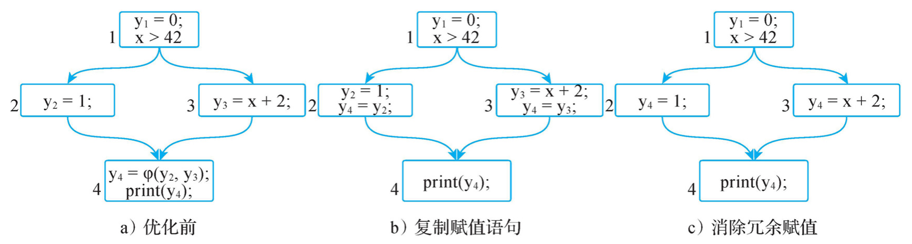
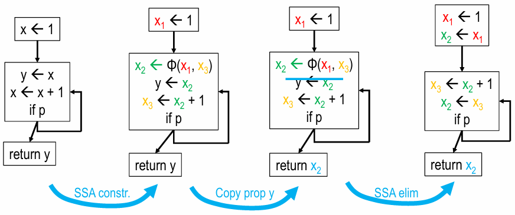
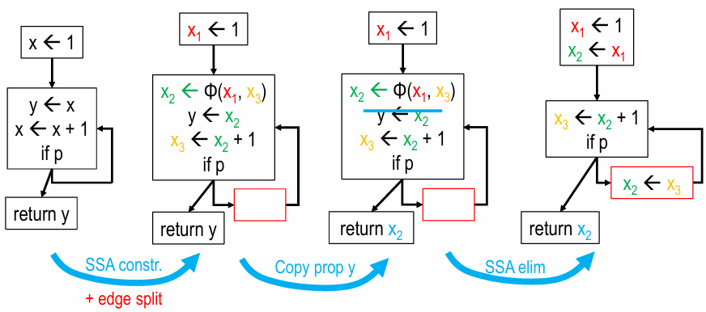
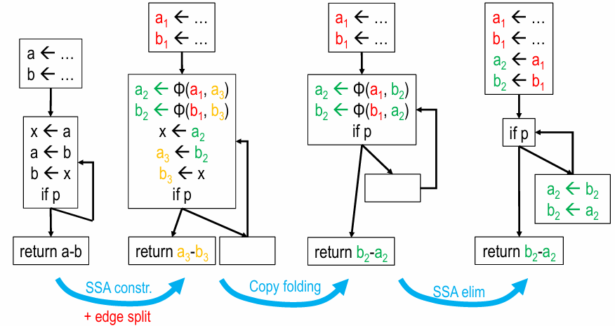

# 静态单赋值(Static Single Assignment, SSA)和φ节点

## SSA基本概念和φ问题

**SSA**是一种IR的形式，它的核心特点为
- **静态**：对代码进行静态分析，不需要考虑代码动态的执行情况
- **单赋值**：每个变量在其作用域内仅被赋值一次

### 单赋值

一个简单的例子：

```C
// 3.c
int main() {
    int x = 10;
    int y = x + 1;
    x = 20;
    int z = x + 2;
    return 0;
}
// clang -S -emit-llvm 3.c -o 3.ll
// 对应的SSA形式示意和LLVM IR中的真实SSA
x1 = 10;        // store i32 10, ptr %2, align 4; %5 = load i32, ptr %2, align 4
y = x1 + 1;     // %6 = add nsw i32 %5, 1
x2 = 20;        // store i32 20, ptr %2, align 4; %7 = load i32, ptr %2, align 4
z = x2 + 2;     %8 = add nsw i32 %7, 2
```

在不涉及分支的例子里SSA很简单，但当同一逻辑变量在不同控制流（分支、循环等）多次赋值时并通过φ节点在控制流汇合处合并各版本时，则引入变量汇聚问题。

```C
// 4.c
#include <stdio.h>
int main() {
    int x = 0;
    int y = 0;
    if (x > 42) {
        y = 1;
    }
    else {
        y = x + 2;
    }
    printf("%d", y);
}
```

```text
// 易读的SSA示意；真实SSA输出可参考 Clang+LLVM编译流程中的SSA 小节中Mem2reg输出。
y1 = 0;
if (x > 42) then {
    y2 = 1;
} else {
    y3 = x + 2;
}
y4 = φ(if:y3, else:y2);
print(y4);
```

φ函数本质上是一个选择操作，指从不同的执行路径中选择执行结果，例如当if语句执行时φ函数的结果为y2，当else语句执行时φ函数的结果为y3。通过重命名和φ函数，SSA达成“单赋值”和“静态”的目的。

### 静态

静态指不考虑实际执行是的分支走向、循环轮数等。下面伪代码的SSA形式CFG如下。

```text
x = 0;
y = 0;
do {
    y = y + x;
    x = x + 1;
} while (x < 10);
print(y);
```

{: width="50%"}

### SSA有什么用

引入SSA形式的目的在于简化编译器的实现，使得每个变量名只对应一次赋值，Def-Use链清晰，易于实现常量传播、死代码消除、公共子表达式消除等功能，且无需额外的繁琐分析。

引入φ函数后，SSA的表达能力就完备了，但通常硬件并没有相应的指令描述φ函数，所以引入φ函数后还需要将φ函数消除（参阅后续小节`SSA析构`）。

### Clang+LLVM编译流程中的SSA

Clang+LLVM编译流程中的SSA生命周期如下：

{: width="100%"}

 - Clang EmitLLVM生成的LLVM IR比较特殊。它自然采用SSA形式，因为变量天然单次定义，若有重名则自动添加后缀（保留变量名）或`%i`的计数器+1（不保留变量名）；而多次赋值被`store`指令表达，不会体现成“多次对同一左值的修改”。

```text
//   clang -S -emit-llvm -Xclang -disable-llvm-passes 4.c -o 4.raw.ll  -Xclang表示将后续参数传给cc1，即要求不跑任何LLVM passes。下面是输出主体
; Function Attrs: noinline nounwind optnone uwtable
define dso_local i32 @main() #0 {
  %1 = alloca i32, align 4
  %2 = alloca i32, align 4
  %3 = alloca i32, align 4
  store i32 0, ptr %1, align 4
  store i32 0, ptr %2, align 4
  store i32 0, ptr %3, align 4
  %4 = load i32, ptr %2, align 4
  %5 = icmp sgt i32 %4, 42
  br i1 %5, label %6, label %7

6:                                                ; preds = %0      // 注释，用于帮人理解前驱BB是谁
  store i32 1, ptr %3, align 4
  br label %10

7:                                                ; preds = %0
  %8 = load i32, ptr %2, align 4
  %9 = add nsw i32 %8, 2
  store i32 %9, ptr %3, align 4
  br label %10

10:                                               ; preds = %7, %6
  %11 = load i32, ptr %3, align 4
  %12 = call i32 (ptr, ...) @printf(ptr noundef @"??_C@_02DPKJAMEF@?$CFd?$AA@", i32 noundef %11)
  %13 = load i32, ptr %1, align 4
  ret i32 %13
}
attributes #0 = { noinline nounwind optnone uwtable "min-legal-vector-width"="0" "no-trapping-math"="true" "stack-protector-buffer-size"="8" "target-cpu"="x86-64" "target-features"="+cmov,+cx8,+fxsr,+mmx,+sse,+sse2,+x87" "tune-cpu"="generic" }

```

 - [Mem2reg](https://llvm.org/docs/Passes.html#reg2mem-demote-all-values-to-stack-slots)是LLVM中端的第一个Transform Pass，它将栈内存转为虚拟寄存器以构建SSA，并添加φ节点。

```text
// 先将4.raw.ll中attributes #0中的optnone删除
// opt -passes=mem2reg 4.raw.ll -S -o 4.mem2reg.ll   单独运行mem2reg。下面是输出主体
; Function Attrs: noinline nounwind uwtable
define dso_local i32 @main() #0 {
  %1 = icmp sgt i32 0, 42
  br i1 %1, label %2, label %3

2:                                                ; preds = %0
  br label %5

3:                                                ; preds = %0
  %4 = add nsw i32 0, 2
  br label %5

5:                                                ; preds = %3, %2
  %.0 = phi i32 [ 1, %2 ], [ %4, %3 ]
  %6 = call i32 (ptr, ...) @printf(ptr noundef @"??_C@_02DPKJAMEF@?$CFd?$AA@", i32 noundef %.0)
  ret i32 0
}
```

 - SelectionDAG的生命周期为指令选择内。因为硬件没有对应φ的算子，所以指令选择天然必须处理掉φ节点，也就不得不破坏SSA。指令选择完成后会恢复SSA的形式
 - 寄存器分配后将虚拟寄存器映射到物理寄存器，彻底打破SSA单赋值约束。

## SSA构造

SSA的构造涉及两步：变量重命名和插入φ函数。插入φ函数后会增加新的变量定义，需要执行变量重命名（如之前将y重命名为y4），因此SSA构造算法可以调整为先插入φ函数再执行变量重命名。插入φ函数需要找到变量的汇聚点，典型方法是通过支配边界来计算（参考`支配分析`章节）。因为支配边界指的是变量的汇聚点，所以只需要在支配边界处插入φ函数即可。由此SSA构造算法可以分解为4步：

 - 遍历程序构造CFG
 - 计算支配边界
 - 根据每一个基本块的支配边界确定φ函数的位置
 - 变量重命名，并将后续使用原变量的地方修改为使用新的变量



[todo] 参考编译器设计9.1-9.4完善

## SSA析构

SSA析构是指将SSA中的φ函数消除。从直觉上讲，SSA析构似乎比较简单，直接将φ函数上移到前驱基本块中，并直接使用赋值语句消除φ函数就好了。

{: width="75%"}

但是这样的消除方法在某些场景是不正确的，可能会引入Lost Copy问题和Swap问题。

### Lost Copy问题

先看一个例子：

{: width="75%"}

假设循环体只执行一轮。则原代码中应当`return 1`。但经过SSA构造、复制传播（此时功能依然正确）、SSA析构之后，最终变成了`return 2`。问题的根源是复制传播和φ消除的不兼容性：当复制传播发生后，变量的生命周期可能发生变更，例如`x2`的生命周期由开始于`x2=φ(x1, x3)`结束于`x3=x2+1`，变成了结束于`return x2`；那么φ消除时在`return x2`之前强行插入了对`x2`的新赋值`x2=x3`自然就会导致后续use`x2`时读到错误的值。

**怎么解决？**

既然问题的根源是复制传播和φ消除的不兼容性，那就得调整二者之一；但复制传播不便调整，个人理解是因为：

- SSA本质是工具，工具应当服务于功能；复制消除可以达成优化性能的功能，那SSA就必须服务这一价值
- LLVM中从构建SSA到析构SSA中间有大量的、由于解耦对SSA构建/析构不可见的Pass，如果对其做限制则会降低整个编译过程的鲁棒性

所以只能调整φ消除。φ问题本质上是由于生命周期的问题导致的，那么解决方案也就会围绕生命周期进行。一种方案是识别冲突变量，然后引入新变量打破活跃区间的冲突，然后对新变量赋值i。例如在`x3=x2+1`之后添加`x4=x2`然后`return x4`。另一种方案是拆分关键边（Critical Edge Splitting）。关键边指的是CFG中边的源节点有多个后继节点，边的目的节点有多个前驱节点。拆分关键边即引入一个新的BB使得不存在关键边。

{: width="75%"}

**为什么lost copy可以被拆分关键边解决？** lost copy的本质是当希望插入φ的赋值时，找不到合适的位置插入这条赋值指令。源节点只有一个后继时，可以直接把拷贝放在源节点的末尾，且不会误伤其他出边（即没人需要循环体提供的值，不会导致后续有节点取到错误的值）；目的节点只有一个前驱时，可以直接把拷贝放在目的节点的入口，且不会误伤其他入边（即循环体不需要外界提供的值，那把赋值直接放在最前也不会踩掉外界的赋值）。只有当源节点有多个后继节点，目的节点有多个前驱节点时，赋值既无法放在源节点末尾，也无法放在目的节点入口，才必须拆边，拆边后对`x2`的重赋值也就不会影响另一条边去往的`return x2`了。

### Swap问题

先看一个例子：

{: width="75%"}

原代码的功能为循环中不断交换`a`和`b`的值。经过SSA构造和关键边拆分、复制折叠（此时功能依然正确）、SSA析构之后，丧失了交换的能力。问题的根源在于φ的天然同步并行本质：在原始φ节点中，`a2=b2`和`b2=a2`同时发生，但φ消除后，`a2=b2`和`b2=a2`变成了顺序的，这导致后者执行时`a2`已经被踩，导致后续`a2`数据错误。

**怎么解决？**

循环依赖（例如本例中`a2`和`b2`交叉依赖）可以引入临时变量解决（`k=a2; a2=b2; b2=k`），非循环依赖可以通过变量排序解决。

注：复制传播面向IR中的变量或虚拟寄存器，复制折叠 面向SelectionDAG或机器指令级别的寄存器，但二者在“去除冗余变量”这一核心目的上并无区别，因此这里不做区分。

## BB参数方案

在构造SSA形式时，目前业界主流依然是在汇聚点使用φ函数表示来自不同路径的同一个变量。但φ函数方案有固有缺点：

- 整体复杂度：插入φ需要多轮分析（支配树＋迭代前沿），剪枝、消除又要专门Pass，比较复杂
- swap问题：如果基本块前驱基本块过多会插入很多φ函数，处理swap问题时较为耗时

最近几年，学者在一些编译器（例如MLIR、Swift等）中使用基本块参数（Basic Block Argument）替代φ函数方案，即把合并后的变量变成目标块的形式参数，各条边都传入实参：

```text
entry:
    x1 = 0;
    y1 = 0;
	jump loop(x1, y1)   // 传参
loop(x2, y2):           // 接收参数数值，变相达成φ赋值
    y3 = y2 + x2;
    x3 = x2 + 1;
    v1 = cmp le x3, 10
    branch v1, loop(x3, y3), exit   // 传参
exit:
	return
```

但该方案也有它的问题：

- 表达问题：CFG模型BB是主要单位，所有指令、变量都归属于BB，而边只表达跳转关系，没有标识符也没有存储空间，无法附带数据。因此，BB参数方案中，入参的取值由边的源节点决定。这就导致如果出现了前驱BB需要`branch cond, BB2(val1), BB2(val2)`时，源节点相同，BB2无法得知该取val1还是val2。但φ节点方案的映射却可以用边，即将val1、val2记录在BB2内，不同的边直接指向不同的val。虽然BB参数方案也有办法可以处理这一问题（例如要求前端别生成这样的IR，添加一个新的基本块以作区分等），但又增加了复杂度
- 兼容性：LLVM/GCC等主流编译器已有完善生态，工具链、调试器都识别φ非传统写法；而BB参数需要大规模改造前端、优化器、后端，适配量巨大
